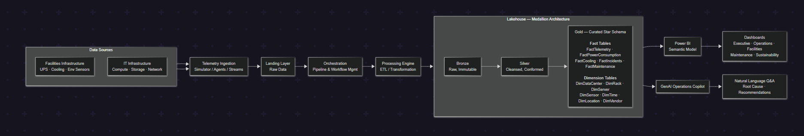
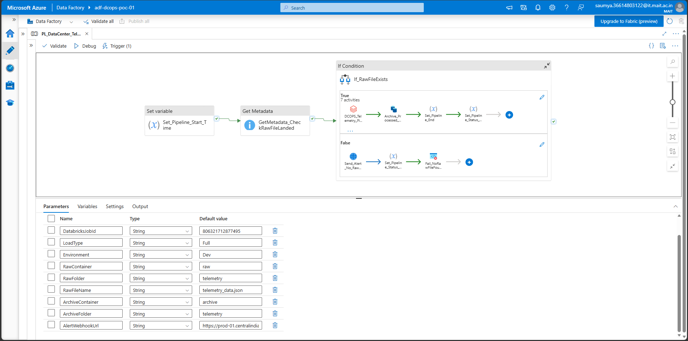
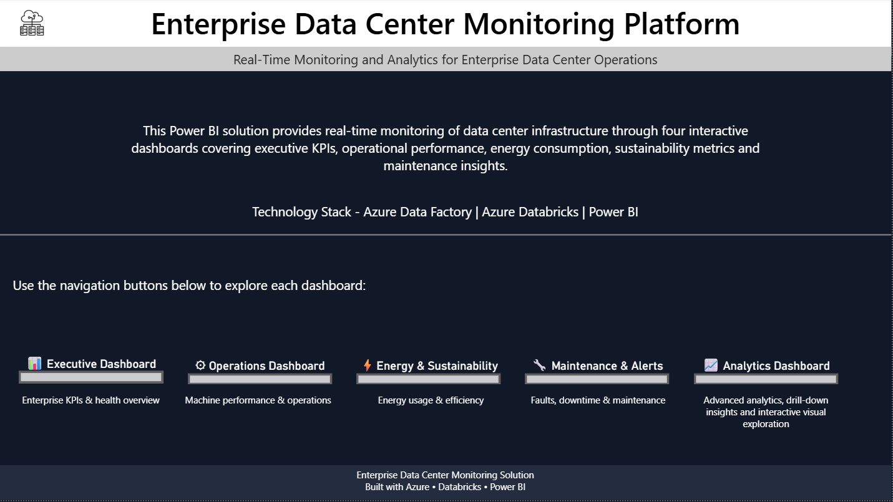
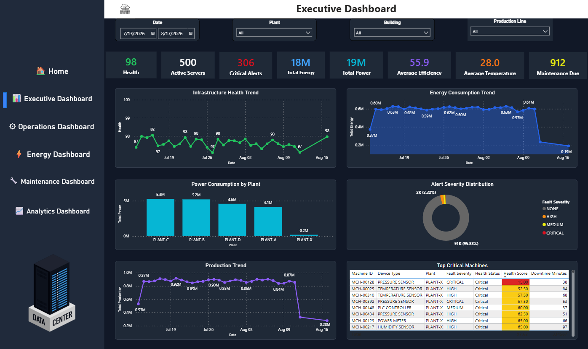
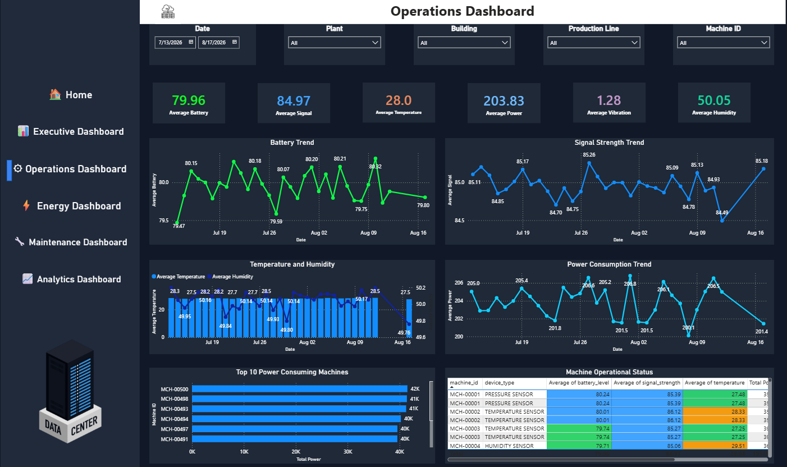
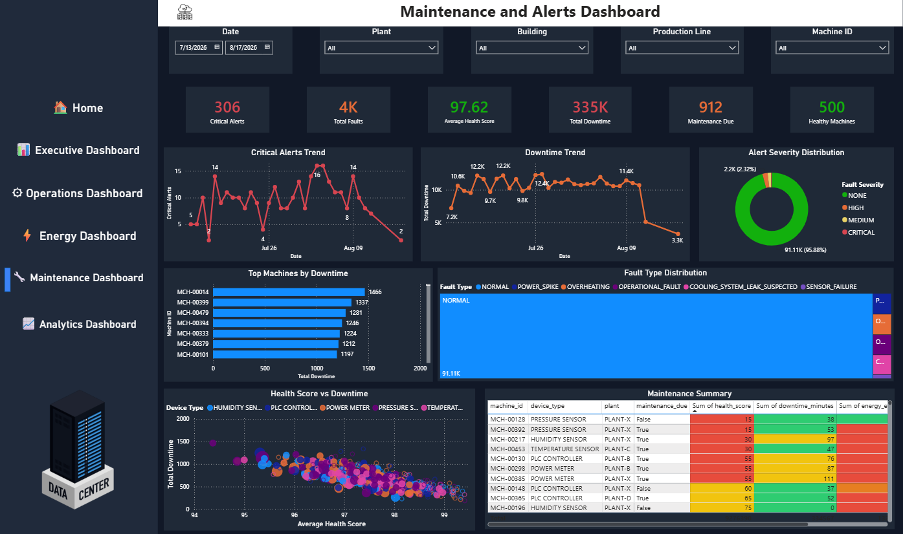
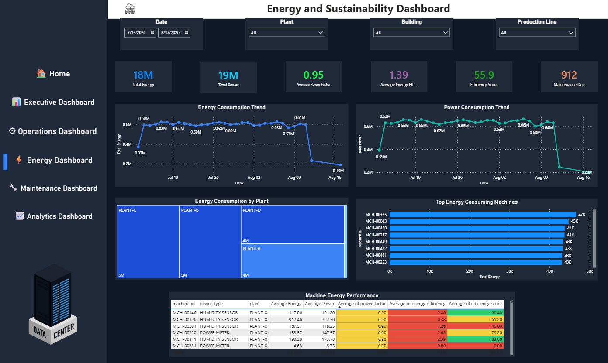
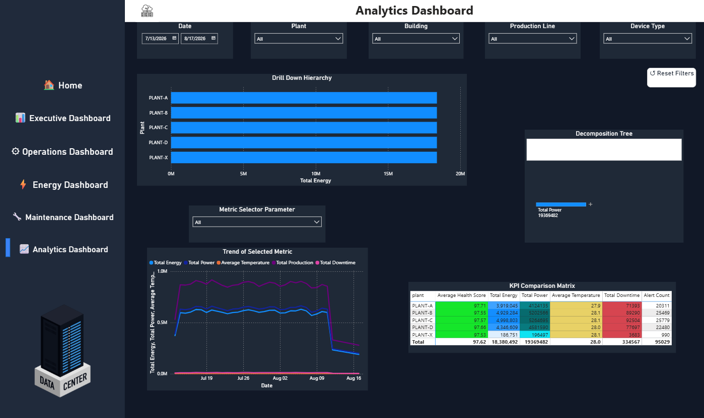

# 🚀 Data Center Operations Platform with AI Copilot


> **An enterprise-scale Azure Data Engineering and AI Analytics platform that processes data center telemetry using a Medallion Architecture, visualizes insights through Power BI dashboards, and enables natural language analytics with an AI-powered Copilot.**

---

# 📖 Overview

Modern data centers generate millions of telemetry events from servers, cooling infrastructure, power systems, and maintenance operations. Transforming this raw operational data into actionable business insights requires scalable data engineering, governed analytics, and intelligent querying.

This project demonstrates the design and implementation of an end-to-end cloud-native analytics platform that combines modern Azure Data Engineering with Generative AI.

The platform ingests telemetry data, processes it through a Medallion Architecture using Azure Databricks, builds analytics-ready datasets, visualizes KPIs through Power BI dashboards, and enables users to interact with operational data using natural language via an AI-powered Copilot.

---

# ✨ Key Features

## ☁️ Data Engineering

- Azure Data Factory orchestration
- Azure Databricks Serverless
- Delta Lake implementation
- Bronze–Silver–Gold Medallion Architecture
- Incremental ETL pipelines
- Data quality validation
- Schema enforcement
- Watermark-based ingestion
- Unity Catalog governance
- Databricks SQL Warehouse

---

## 📊 Business Intelligence

- Executive Dashboard
- Operations Dashboard
- Maintenance Dashboard
- Energy Dashboard
- Analytics Dashboard
- Interactive Power BI reports

---

## 🤖 AI Copilot

- Natural Language to SQL
- AI-generated SQL using Google Gemini
- SQL validation layer
- Databricks SQL execution
- AI-generated executive summaries
- Conversational Streamlit interface
- Chat history
- CSV export
- Azure App Service deployment

---

# 🏗️ Solution Architecture



The platform follows a modern cloud-native architecture where telemetry data is ingested into Azure Data Lake Storage, processed through Azure Databricks using the Medallion Architecture, and transformed into business-ready datasets.

The Gold layer serves as the analytical foundation for both Power BI dashboards and the AI Copilot.

---

# 🔄 Data Pipeline



```text
Telemetry Generator
        │
        ▼
Azure Data Lake Storage
        │
        ▼
Bronze Layer
        │
        ▼
Silver Layer
        │
        ▼
Gold Layer
        │
        ├────────► Power BI
        │
        └────────► AI Copilot
```

---

# 🏛️ Medallion Architecture

## 🥉 Bronze Layer

Raw immutable telemetry data.

- Server telemetry
- Alert logs
- Power metrics
- Cooling metrics
- Maintenance records

---

## 🥈 Silver Layer

Validated and standardized datasets.

- Data cleansing
- Deduplication
- Schema validation
- Type conversion
- Null handling
- Data quality checks

---

## 🥇 Gold Layer

Business-ready dimensional model.

### Dimensions

- Data Center
- Server
- Date

### Facts

- Alerts
- Maintenance
- Power Consumption
- Cooling Metrics

---

# 🤖 AI Copilot Workflow

```text
User Question
      │
      ▼
Google Gemini
      │
      ▼
SQL Generation
      │
      ▼
SQL Validation
      │
      ▼
Databricks SQL Warehouse
      │
      ▼
Query Results
      │
      ▼
AI Executive Summary
      │
      ▼
Streamlit Application
```

Users can ask questions such as:

- Which servers require maintenance?
- Show the highest power consuming servers.
- Which data center has the most alerts?
- Show the lowest health score servers.
- Compare maintenance activities across locations.

---

# 📊 Power BI Dashboards

## 🏠 Home



---

## 📈 Executive Dashboard



Provides executive KPIs including:

- Overall Health Score
- Active Alerts
- Power Consumption
- Maintenance Overview

---

## ⚙️ Operations Dashboard



Provides:

- Server utilization
- Rack analytics
- Device performance
- Operational trends

---

## 🔧 Maintenance Dashboard



Provides:

- Maintenance trends
- Failure analysis
- Health score tracking
- Service history

---

## ⚡ Energy Dashboard



Provides:

- Energy consumption
- Cooling efficiency
- Operational costs
- Power usage trends

---

## 📉 Analytics Dashboard



Provides cross-functional business insights for operational decision-making.

---

# 🛠️ Technology Stack

| Category | Technologies |
|-----------|--------------|
| Cloud | Microsoft Azure |
| Storage | Azure Data Lake Storage Gen2 |
| ETL | Azure Data Factory |
| Processing | Azure Databricks (Serverless) |
| Lakehouse | Delta Lake |
| Governance | Unity Catalog |
| Warehouse | Databricks SQL Warehouse |
| Database | Azure SQL |
| Analytics | Power BI |
| AI | Google Gemini |
| Frontend | Streamlit |
| Languages | Python, PySpark, SQL |
| Version Control | Git & GitHub |
| CI/CD | GitHub Actions |
| Hosting | Azure App Service |

---

# 📁 Repository Structure

```text
data-center-operations-platform/
│
├── architecture/
├── infrastructure/
├── telemetry_generator/
├── DataCenter_AI/
│   ├── ai/
│   ├── assets/
│   ├── app.py
│   ├── main.py
│   ├── db.py
│   ├── config.py
│   └── requirements.txt
│
├── powerbi/
│   └── PowerBI_Report.pbix
│
└── README.md
```

---

# 🚀 Getting Started

### Clone the repository

```bash
git clone https://github.com/YOUR_USERNAME/data-center-operations-platform.git
```

### Navigate to the AI application

```bash
cd DataCenter_AI
```

### Install dependencies

```bash
pip install -r requirements.txt
```

### Configure environment variables

Create a `.env` file with:

```env
DATABRICKS_SERVER_HOSTNAME=
DATABRICKS_HTTP_PATH=
DATABRICKS_TOKEN=
GEMINI_API_KEY=
```

### Run the application

```bash
streamlit run app.py
```

---

# 🌐 Live Demo

🔗 **Streamlit App Deployment**

> [Data Center AI Copilot](https://data-center-ai-copilot.streamlit.app)

---

# 💼 Business Value

This solution demonstrates how modern organizations can transform operational telemetry into actionable insights through a combination of cloud-native data engineering, interactive analytics, and Generative AI.

The platform enables:

- Enterprise-scale ETL
- Self-service analytics
- Executive reporting
- Natural language data exploration
- AI-assisted decision making

---

# 🚀 Future Enhancements

- Real-time streaming using Azure Event Hubs
- Kafka integration
- Predictive maintenance with Machine Learning
- LangChain and LangGraph agents
- Retrieval-Augmented Generation (RAG)
- Voice-enabled AI assistant
- Automated visualization recommendations
- Microsoft Teams integration
- Azure OpenAI support
- Role-Based Access Control (RBAC)
- Multi-agent AI workflows

---

# 📚 Skills Demonstrated

- Azure Data Engineering
- Azure Data Factory
- Azure Databricks
- Delta Lake
- Medallion Architecture
- Data Modeling
- ETL Pipeline Development
- Data Quality Engineering
- Power BI
- Streamlit
- Google Gemini
- Prompt Engineering
- Natural Language to SQL
- Databricks SQL Warehouse
- Cloud Deployment
- GitHub Actions
- CI/CD

---

# 👨‍💻 Author

**Saumya Taneja**

**Data Engineer | Analytics Engineer | Generative AI Enthusiast**

- GitHub: https://github.com/SaumyaTaneja7
